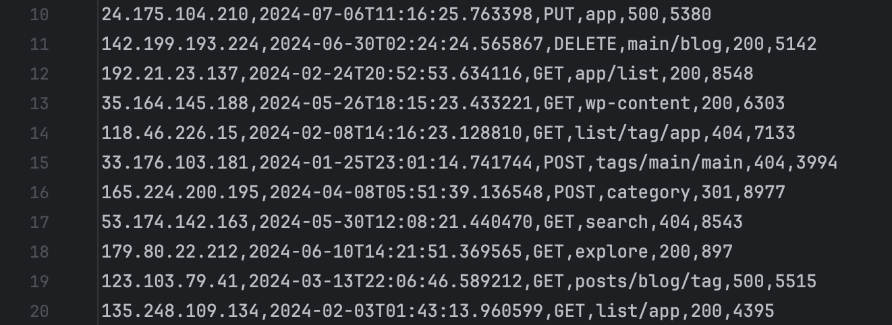
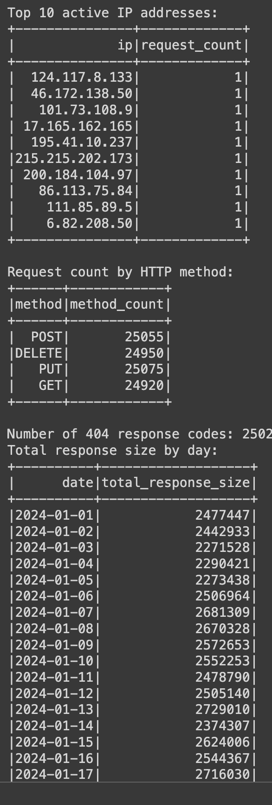

# Итоговое задание  №5
Используя полученные в этом разделе знания, решите следующую задачу.

Задание состоит из двух частей. Но, первую часть мы помогли Вам решить :)

## Часть 1. Генерация информации
Мы использовали библиотеку Faker для генерации логов веб-сервера. Логи содержат следующую информацию:  

- IP-адрес клиента  
- Временная метка запроса  
- HTTP-метод (GET, POST, etc.)  
-  URL запроса  
-  Код ответа (200, 404, etc.)  
-  Размер ответа в байтах  

Сгенерировали 100,000 записей логов и сохранили их в CSV-файл. __Не забудьте сделать !pip install faker__
````
import csv
from faker import Faker
import random

fake = Faker()

num_records = 100000

http_methods = ['GET', 'POST', 'PUT', 'DELETE']
response_codes = [200, 301, 404, 500]

file_path = "web_server_logs.csv"

with open(file_path, mode='w', newline='') as file:
    writer = csv.writer(file)
    writer.writerow(['ip', 'timestamp', 'method', 'url', 'response_code', 'response_size'])
    
    for _ in range(num_records):
        ip = fake.ipv4()
        timestamp = fake.date_time_this_year().isoformat()
        method = random.choice(http_methods)
        url = fake.uri_path()
        response_code = random.choice(response_codes)
        response_size = random.randint(100, 10000)
        
        writer.writerow([ip, timestamp, method, url, response_code, response_size])

print(f"Сгенерировано {num_records} записей и сохранено в {file_path}")
````
Пример получившихся данных.



## Часть 2. Анализ информации

1. Сгруппируйте данные по IP и посчитайте количество запросов для каждого IP, выводим 10 самых активных IP. Формат вывода, как на скрине ниже.

2. Сгруппируйте данные по HTTP-методу и посчитайте количество запросов для каждого метода.

3. Профильтруйте и посчитайте количество запросов с кодом ответа 404.

4. Сгруппируйте данные по дате и просуммируйте размер ответов, сортируйте по дате.

__Формат вывода должен соответствовать тому, "как на картинке"__



